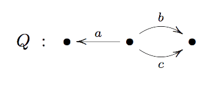

# Announcing free-categories

## motivation

The `Category` typeclass in Haskell apparently doesn't
get much use which is a real shame. But many Haskellers
are familiar with it.

```Haskell
class Category c where
  id :: c x x
  (.) :: c y z -> c x y -> c x z
```

Instances include `(->)`, the category of Haskell types and functions,
and `Kleisli`, the Kleisli category of a `Monad`. In
[Squeal](https://github.com/morphismtech/squeal/),
there's another instance, `Definition`, the category of
database schemas and DDL statements (`CREATE`, `DROP` and `ALTER`).

For a while I was puzzling on how to add migration support to Squeal.
Support for DDL gets you a long way, but not the whole way.
As a first pass, you can say your migration system is just `Definition`s
with the `Category` instance allowing you to chain your migrations
together. But, a migration system needs to track which `Definition` has
been run in the past and skip it. That means you need to be able
to do some processing on each `Definition` in your chain. Composing
the `Definition`s smashes them together into a single `Definition`.
I needed a data structure that held a list of migrations that can be
but are not yet composed.

```Haskell
{-# LANGUAGE GADTs #-}
data Path p x y where
  Done :: Path p x x
  (:>>) :: p x y -> Path p y z -> Path p x z
```

`Path p` is the "free category" or "path category" with steps in `p`.
`Path p` has a `Category` instance even if `p` does not.
`Path` covered my need and also conveniently solved another problem.
Squeal also supported `WITH` statements, however, they had a problem.
As I had typed them, I used a heterogeneous list to contain
the common table expressions. This meant that each CTE had to reference
the same underlying schema and could not therefore reference previous
CTEs in the list. Using a `Path` instead fixed that problem, allowing
each step to append to the schema.

## previous

At this point, it was clear this was a cool little data structure
since it solved two different problems.

So I looked around for this datatype and I remembered a paper,
[Reflection without Remorse](http://okmij.org/ftp/Haskell/zseq.pdf),
written by Atze van der Ploeg and Oleg Kiselyov. They used `Path`s
of `Kleisli` for efficient monadic reflection. They also introduce
isomorphic datatypes to `Path`.
The paper
[Kleisli Arrows of Outrageous Fortune](https://personal.cis.strath.ac.uk/conor.mcbride/Kleisli.pdf)
written by Conor McBride also uses `Path`, even naming it so.

A couple of libraries also had it. A support library for reflection
without remorse [type-aligned](https://github.com/atzeus/type-aligned)
existed. Also the library
[free-category](https://github.com/coot/free-category) which took
those ideas further.

But I come from the land of category theory, and code wasn't really
clarifying to me what this structure was and how it related to
other similar datatypes. It turned out that in mathematics, the
free category was related to something I had studied in my earlier days.

## quivers

Like all "free" constructions from the land of category theory,
the free category was a left adjoint to a "forgetful" functor.
That forgetful functor forgot the category structure leaving behind
a "quiver".

A quiver is like a pre-category. Like categories have objects and
morphisms, a quiver has vertices and arrows, but it doesn't have
to have identities or composition and there are no laws. So, a quiver
is a graph. It's a directed graph, or digraph, because the edges are arrows
and have a direction. Sometimes it's called a multi-digraph, because
there may be multiple arrows between vertices.



In math, quivers are usually studied in the context of representation
theory and algebraic geometry so I was a bit shocked to see them
in programming in a very different context. I had seen them
when I was studying quantum algebra under my advisor Alexander Kirillov Jr.
He even wrote a
[book](https://www.amazon.com/Representations-Varieties-Graduate-Studies-Mathematics/dp/1470423073)
about quivers!

A Haskell quiver is a higher kinded type,

`p :: k -> k -> Type`

  * where vertices are types `x :: k`,
  * and arrows from `x` to `y` are terms `p :: p x y`.

Lots of familiar things in Haskell are quivers, including all
instances of `Category`, `Arrow`, `Bifunctor` and `Profunctor`.
Haskell quivers aren't as general as the quivers from category
theory land, but that's ok.

## the eightfold path

Haskell quivers form a category with

* objects are quivers
  * `p :: k -> k -> Type`
* morphisms are terms of `RankNType`,
  * `forall x y. p x y -> q x y`
* identity is `id`
* composition is `.`

`Prelude`'s `id` and `.` work for quiver morphisms,
thanks to universal quantification. This category turns out
pretty interesting, and in many ways is analagous to Hask, the
category of Haskell `Type`s and functions. It has two interesting
monoidal products, a Cartesian product and a "composition".
And like Hask, the category of Haskell quivers has a useful hierarchy of
endofunctor typeclasses, which may be used to provide a familiar
API for the free category functor.

```Haskell
class QFunctor c where
  qmap :: (forall x y. p x y -> q x y) -> c p x y -> c q x y
class QFunctor c => QPointed c where
  qsingle :: p x y -> c p x y
class QFunctor c => QFoldable c where
  qfoldMap :: Category q => (forall x y. p x y -> q x y) -> c p x y -> q x y
```

The free category is left adjoint to "forgetting" the `Category` constraint.
If you unpack the definition of left adjoint in this case you find that for
a free category functor `c` you have a quiver morphism

`i :: p x y -> c p x y`

and a function of quiver morphisms to a `Category`,

`u :: Category q => (forall x y. p x y -> q x y) -> c p x y -> q x y`

such that

`u f . i = f`

and that these functions characterize `c` up to isomorphism as a universal property.

But, `u` and `i` have the same type signatures as `qfoldMap` and `qsingle`.
So, you can characterize the free category abstractly as a constraint.

```Haskell
{-# LANGUAGE QuantifiedConstraints #-}
class
  ( QPointed c
  , QFoldable c
  , forall p. Category (c p)
  ) => CFree c where
```

The free category constraint doesn't have any methods. It just has a law
which GHC can't enforce. All data structures that implement those classes
in a law abiding way are isomorphic.

## utility

So, I put my study of the free category into a library with
some combinators, an API and data types, I found I could re-apply
what I had learned back to Squeal migrations. It helped me clean up
and generalize that code in a nice way. I hope to see some other
uses found for free categories.
